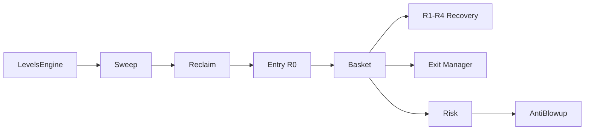

# RLVR MQL5 — Full Build v2

**Reclaimed Liquidity Void Reset** — structure-first XAUUSD system with bounded recovery.

## Layout

```text
Experts/RLVR/RLVR_EA.mq5
Include/RLVR/
  Types.mqh, Config.mqh
  LevelsEngine.mqh
  SweepDetector.mqh, ReclaimDetector.mqh, Invalidation.mqh
  EntryEngine.mqh, RecoveryEngine.mqh, ExitManager.mqh
  BasketManager.mqh, RiskManager.mqh, AntiBlowup.mqh, RegimeFilter.mqh
  TradeUtils.mqh, StateMachine.mqh (CRLVRController)
  Telemetry.mqh, AtrUtils.mqh
```

## Install

1. Copy `MQL5/Experts/RLVR/` and `MQL5/Include/RLVR/` into terminal data folder
2. Compile `RLVR_EA.mq5` (requires `#include <Trade/Trade.mqh>`)
3. Attach to **XAUUSD M5**

## Modes

| `InpDryRun` | Behavior |
|---|---|
| `true` (default) | Full state machine + CSV telemetry, **no real orders** |
| `false` | Live market orders with magic `InpMagic` |

**Start with dry-run on Strategy Tester**, then parity-check against Python harness before `InpDryRun=false`.

## Pipeline (one basket max)



## Key inputs

| Input | Default | Role |
|---|---|---|
| `InpDryRun` | true | Simulated vs live fills |
| `InpRiskPerBasket` | 0.0125 | 1.25% equity budget |
| `InpBasketDdLimit` | 0.0125 | Per-basket float DD cap |
| `InpDailyDdLimit` | 0.025 | Daily halt |
| `InpBaselineSpread` | 0.30 | Regime spread reference |
| `InpManualLevelEnable` | false | Parity / tester level |

## Anti-blowup (always on)

- Basket / daily / weekly DD circuit breakers
- Margin cap 25%
- 2 defensive shutdowns → session halt
- Emergency flatten → 4h cooldown
- Normal basket exit → 30m cooldown

## Telemetry

`Common/Files/RLVR_events.csv` — same schema as Python harness.

Events include: `SWEEP_START`, `RECLAIM`, `R0_OPEN`, `R1_ADD`…`R4_ADD`, `PARTIAL_CLOSE`, `BASKET_TP`, `TRAIL_EXIT`, `FLATTEN`, `INVALIDATION`.

## Parity validation

```bash
python3 -m unittest discover -s tools/rlvr_replay/tests -v

python3 -m tools.rlvr_replay.parity_compare \
  --python-events /tmp/py_events.csv \
  --mt5-events /path/to/RLVR_events.csv
```

## Docs

- [Formal spec](../docs/rlvr/RLVR-FORMAL-SPECIFICATION.md)
- [LevelsEngine](../docs/rlvr/modules/LEVELS-ENGINE-PSEUDOCODE.md)
- [SweepDetector](../docs/rlvr/modules/SWEEP-DETECTOR-PSEUDOCODE.md)

## v2.1 backlog

- EQH/EQL fractal levels
- News CSV gate
- ATR percentile vol regime (p20–p95)
- Freeze `entry_atr_m5` at sweep start
- Broker SL for compliance on deep baskets
