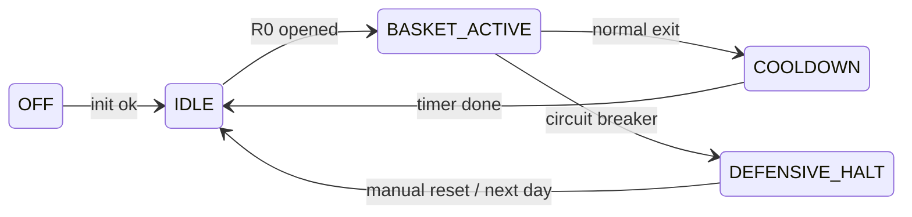
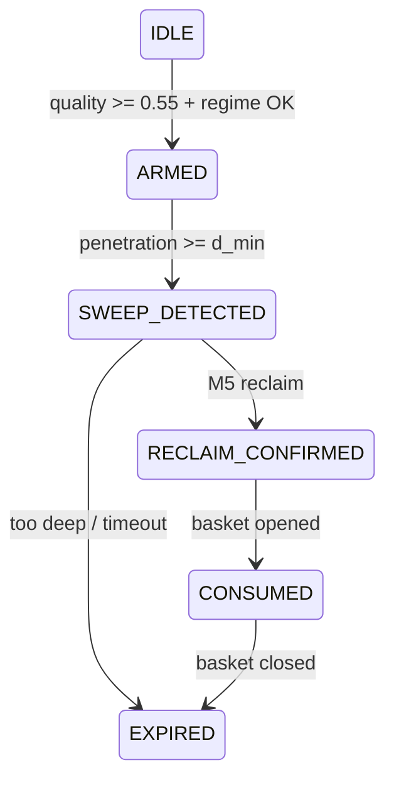
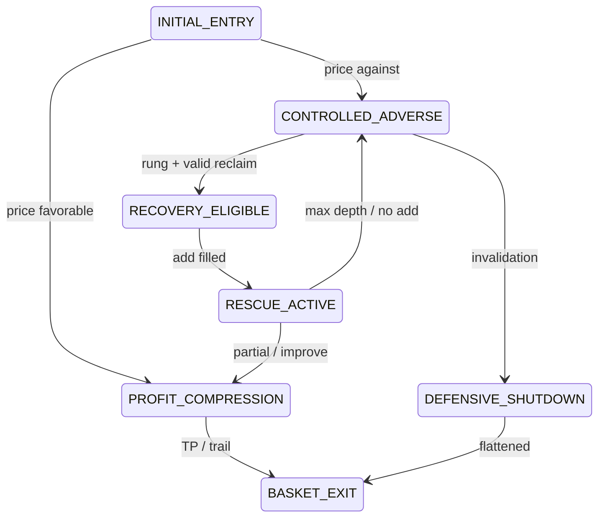

# RLVR State Machine Reference

Quick-reference companion to `RLVR-FORMAL-SPECIFICATION.md`.

## Global EA flow



## Per-level lifecycle



## Basket sub-state flow



## Decision precedence (highest first)

| Priority | Check | Result |
|---:|---|---|
| 1 | Hard invalidation INV-1..6 | Flatten immediately |
| 2 | CB-2 Daily DD | Flatten + halt day |
| 3 | CB-1 Basket DD | Flatten + cooldown |
| 4 | CB-4 Margin | Flatten |
| 5 | SOFT-1 | No adds; manage exit |
| 6 | Recovery eligible | Allow R1–R4 |
| 7 | Profit rules | Partial / TP / trail |

## Forbidden add conditions (must be false to add)

```text
reacceptance_beyond_L
close_beyond_sweep_extreme_plus_buffer
reclaim_ttl_expired
daily_dd_breached
two_failures_this_session
news_window_active
atr_spike_kill
soft_invalidation_active
margin_over_limit
projected_risk_over_budget
```

## Timer responsibilities (1s)

| Check | Frequency |
|---|---|
| TTL expiry | every tick |
| Cooldown elapsed | every tick |
| DD / margin | every tick |
| Forced flatten retries | every tick when active |
| Level expiry | every tick |
| New M5 bar events | on bar change only |
