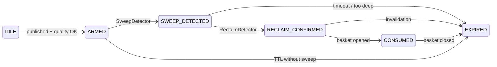

# LevelsEngine — Module Deep-Dive (Pseudocode)

**System**: RLVR v1.0  
**Spec reference**: `RLVR-FORMAL-SPECIFICATION.md` §5  
**Harness reference**: `tools/rlvr_replay/levels.py` (PDH/PDL subset)  
**MQL5 reference**: `MQL5/Include/RLVR/LevelsEngine.mqh`  

---

## 1. Purpose

`LevelsEngine` discovers, scores, merges, and serves **reference liquidity levels** `L` that RLVR may arm for sweep detection.

Without valid levels, RLVR has nothing structural to fade. This module is the **map of where gold liquidity is likely pooled** — not a signal generator.

**Design invariant**: Levels are **pre-qualified liquidity references** with expiry and quality score. The engine does not open trades.

---

## 2. Responsibilities

| In scope | Out of scope |
|---|---|
| Compute PDH/PDL, session H/L | Sweep detection |
| Detect EQH/EQL clusters (M15) | Reclaim / invalidation |
| Round-number candidates near price | Regime filter (separate module) |
| Quality scoring + merge | Basket / recovery |
| Active level queue (max N armed) | Order execution |
| Level expiry / consumption | News calendar |

---

## 3. Level taxonomy and priority

Higher priority wins when prices fall within `level_merge_distance`.

| Priority | Type | Definition | Default expiry |
|---:|---|---|---|
| 1 | `PDH` / `PDL` | Prior broker-day D1 high/low | End of current D1 |
| 2 | `ASIA_H` / `ASIA_L` | High/low of Asia session window | London open + 4h |
| 3 | `LONDON_H` / `LONDON_L` | High/low of London window | NY open + 4h |
| 4 | `EQH` / `EQL` | Equal highs/lows cluster (≥2 pivots) | 24h or consumed |
| 5 | `ROUND` | `round_step` increments near price | 12h rolling |

---

## 4. Data structures

### LiquidityLevel

```text
level_id: string
type: LevelType
price L: double
quality_score: float [0,1]
created_at: datetime
expires_at: datetime
state: LevelState          // starts ARMED when published
touch_count: int           // for scoring
session_tag: SessionTag
```

### LevelsRegistry

```text
levels: LiquidityLevel[]   // max MAX_LEVELS_REGISTRY (e.g. 64)
count: int
last_refresh: datetime
```

---

## 5. Session windows (server time, configurable)

```text
ASIA:   [00:00, 07:59]
LONDON: [08:00, 12:59]
NY:     [13:00, 17:59]    // used for expiry anchors
```

Session H/L are finalized at window end, published at next boundary.

---

## 6. Quality score

```text
score = w1 * touch_count_norm
      + w2 * recency_norm
      + w3 * session_relevance
      + w4 * round_number_bonus

w1=0.35, w2=0.25, w3=0.30, w4=0.10
```

| Component | PDH/PDL | Session H/L | EQH/EQL | ROUND |
|---|---|---|---|---|
| touch_count_norm | 0.8 default | touches in window | cluster size / 5 | 0.3 |
| recency_norm | 1.0 at publish | 1.0 at publish | age decay | proximity |
| session_relevance | 0.7 | 1.0 if liquid session | 0.6 | 0.4 |
| round_number_bonus | 0 | 0 | 0 | 0.5 if within 0.5·ATR_H1 |

**Arm threshold:** `quality_score >= 0.55` (config `level_quality_threshold`)

---

## 7. Merge rule

```text
merge_distance = max(0.10 * ATR_M15, spread * 5)

for each new level N:
    for each existing level E:
        if abs(N.price - E.price) <= merge_distance:
            if priority(N.type) < priority(E.type):   // lower number = higher priority
                discard N
            else if priority(N) == priority(E):
                keep newer higher quality
            else:
                remove E, add N
```

---

## 8. Source algorithms

### 8.1 PDH / PDL

```text
on D1 bar open (new broker day):
    pdh = iHigh(symbol, PERIOD_D1, 1)
    pdl = iLow(symbol, PERIOD_D1, 1)
    publish Level(PDH, pdh, created=now, expires=end_of_day)
    publish Level(PDL, pdl, created=now, expires=end_of_day)
```

**Harness subset:** aggregate prior calendar day from M5 bars (see `build_pdh_pdl_levels`).

### 8.2 Asia / London session H/L

```text
on session window close:
    asia_high = max(high) of M5 bars in Asia window
    asia_low  = min(low)  of M5 bars in Asia window
    publish ASIA_H, ASIA_L with expiry = london_open + 4h

on London window close:
    london_high/low similarly
    expiry = ny_open + 4h
```

### 8.3 Equal highs / lows (M15 fractals)

```text
pivots = fractal_pivots(M15, left=3, right=3)
cluster highs where abs(pivot_i - pivot_j) <= 0.08 * ATR_M15
if cluster.count >= 2:
    EQH price = max(cluster prices)
    publish EQH

mirror for lows -> EQL
```

### 8.4 Round numbers

```text
nearest_round = round(price / round_step) * round_step   // step=50
if abs(price - nearest_round) <= 0.5 * ATR_H1:
    publish ROUND at nearest_round, expiry = now + 12h
```

---

## 9. Active level selection

Called each M5 bar before sweep processing.

```text
function ActiveLevelsAt(now, registry, config) -> levels[]

    candidates = []
    for level in registry.levels:
        if level.state not in {ARMED, SWEEP_DETECTED, RECLAIM_CONFIRMED}:
            continue
        if now < level.created_at or now >= level.expires_at:
            continue
        if level.quality_score < config.level_quality_threshold:
            continue
        candidates.push(level)

    sort candidates by (-quality_score, created_at)
    return first config.max_armed_levels candidates
```

**Critical:** `RECLAIM_CONFIRMED` must remain active so `Invalidation` can run (harness bugfix).

---

## 10. State transitions (level lifecycle)



LevelsEngine publishes `ARMED` and handles `EXPIRED` from time; sweep/reclaim modules mutate intermediate states.

---

## 11. Full pseudocode — refresh cycle

```text
function LevelsEngine.OnNewM5Bar(bar, context):

    if IsNewD1Bar():
        RefreshPDHPDL()

    if IsAsiaSessionJustClosed():
        RefreshAsiaHighLow()

    if IsLondonSessionJustClosed():
        RefreshLondonHighLow()

    if IsNewM15Bar():
        RefreshEqualHighLowClusters()

    RefreshRoundNumberNearPrice(context.bid)

    MergeAndPruneExpired(context.now)

    // Manual / tester parity level (optional input)
    if context.manual_level_enabled:
        UpsertManualLevel(context.manual_level)

    return registry
```

```text
function MergeAndPruneExpired(now):

    for i = registry.count-1 downto 0:
        if registry.levels[i].expires_at <= now:
            remove registry.levels[i]
        if registry.levels[i].state == EXPIRED:
            remove or mark dead

    ApplyMergePass(registry, ATR_M15, spread)
```

---

## 12. Edge cases

| Case | Behavior |
|---|---|
| Gap over PDH at open | PDH still valid; sweep measured from L |
| PDH == ROUND within merge | Keep PDH (priority 1) |
| Multiple EQH clusters | Keep most recent highest-quality |
| Level armed mid-warmup (tester) | `created_at` must be ≤ bar time to arm |
| Broker D1 boundary differs | Document broker; use `TimeTradeServer()` |
| Daylight saving shift | Session windows configurable; re-validate |

---

## 13. Test vectors

| ID | Setup | Expected |
|---|---|---|
| L1 | New D1, prior high=2405 | PDH armed at 2405 |
| L2 | Two levels 0.05·ATR apart PDH+ROUND | Single merged PDH |
| L3 | quality=0.50 | Not in ActiveLevelsAt |
| L4 | expires_at passed | Pruned |
| L5 | 4 levels quality>0.55 | Active returns top 3 by score |
| L6 | Manual level 2400, created_at = sweep bar | Arms for parity fixture |
| L7 | Asia session completes | ASIA_H/L published |

---

## 14. MQL5 mapping

### Class

```cpp
class CLevelsEngine
{
public:
   bool     Init(const string symbol, const LevelsConfig &cfg);
   void     OnNewM5Bar();
   int      GetActiveLevels(CLiquidityLevel &out[], const int max_count);
   bool     AddManualLevel(const CLiquidityLevel &level);
   int      GetRegistryCount() const;

private:
   void     RefreshPDHPDL();
   void     RefreshSessionLevels();
   void     RefreshEqualHighLow();
   void     RefreshRoundLevels(const double price);
   void     MergeRegistry();
   void     PruneExpired();
   double   ComputeQualityScore(const LevelDraft &draft) const;
};
```

### v1 dry-run scope

| Feature | v1 EA | v1.1 |
|---|---|---|
| PDH/PDL | Yes | — |
| Manual input level | Yes (parity) | — |
| Asia/London H/L | Yes | — |
| EQH/EQL | Stub/log only | Full |
| ROUND | Yes | — |
| Merge | Yes | — |

---

## 15. Failure modes (adversarial)

| Failure | Symptom | Mitigation |
|---|---|---|
| Stale PDH on gap day | Wrong L | Confirm D1 shift index = 1 |
| Over-merge | Missing nearby pool | Lower merge factor only after OOS |
| Too many ROUND levels | Queue noise | Proximity filter + 12h expiry |
| EQH overfit | Pretty backtest | Freeze fractal params |
| Session TZ mismatch | London H wrong | `InpServerUtcOffset` input |

---

## 16. Parity with Python harness

| Capability | Python `levels.py` | MQL5 v1 |
|---|---|---|
| PDH/PDL | M5 aggregate prior day | `iHigh/iLow` D1 shift 1 |
| Manual level | CSV fixture | `InpManualLevel*` inputs |
| Session H/L | Not in harness | MQL5 only (extend Python later) |
| Active selection | `active_levels_at()` | `GetActiveLevels()` |

Parity tests use **`--no-pdh-pdl` + manual levels CSV** to isolate sweep/reclaim logic first.

---

*v1.1 backlog: port session H/L + EQH to Python harness for full cross-validation.*

---

*End of LevelsEngine module deep-dive*
