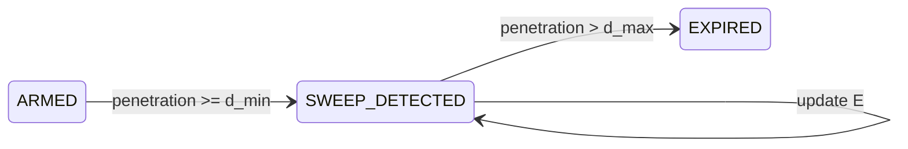

# SweepDetector — Module Deep-Dive (Pseudocode)

**System**: RLVR v1.0  
**Spec reference**: `RLVR-FORMAL-SPECIFICATION.md` §7  
**Harness reference**: `tools/rlvr_replay/sweep.py`  
**Primary timeframe**: M5 bar events  

---

## 1. Purpose

`SweepDetector` identifies when price **engineers liquidity** beyond a pre-qualified reference level `L` by at least `d_min`, without immediately qualifying as a true breakout (`> d_max`).

It is the **first structural gate** in RLVR. No fade, no recovery, no martingale until sweep state is valid.

**Design invariant**: Sweep detection is **level-relative and ATR-scaled**, never fixed pips.

---

## 2. Responsibilities

| In scope | Out of scope |
|---|---|
| Detect sweep start on armed levels | Level discovery (LevelsEngine) |
| Track sweep extremum `E` | Reclaim confirmation (ReclaimDetector) |
| Disqualify deep penetrations | Entry orders (EntryEngine) |
| Expire stale sweeps (window/TTL via orchestrator) | Recovery ladder |
| Emit telemetry events | Regime filtering (RegimeFilter) |

---

## 3. Inputs and outputs

### Inputs (per M5 bar close or tick policy v1.1)

```text
level: LiquidityLevel       // state ∈ {ARMED, SWEEP_DETECTED}
bar: Bar                    // M5 OHLC
atr_m5: float               // Wilder ATR(14) on M5, > 0
config: StructureConfig
```

### Outputs

```text
events: SweepEvent[]
mutated level fields:
  - state
  - sweep_side            // "above" | "below"
  - sweep_start_time
  - sweep_start_bar_index
  - sweep_extreme E
```

### Event types

| Event | Meaning |
|---|---|
| `SWEEP_START` | Valid penetration ≥ d_min detected |
| `SWEEP_TOO_DEEP` | Penetration > d_max → level EXPIRED |
| `SWEEP_EXTREMUM_UPDATE` | Optional debug; E moved deeper (v1.1) |

---

## 4. Derived thresholds

```text
d_min = config.sweep_depth_min_atr * atr_m5     // default 0.15
d_max = config.sweep_depth_max_atr * atr_m5     // default 0.80
```

**Interpretation on XAUUSD**:

- `d_min` filters noise touches of round/session levels.
- `d_max` rejects moves likely driven by acceptance, not stop-run mechanics.

---

## 5. Penetration functions

### Upside (fade-sell candidate)

```text
upside_penetration(bar, L):
    if bar.high <= L:
        return 0
    return bar.high - L
```

### Downside (fade-buy candidate)

```text
downside_penetration(bar, L):
    if bar.low >= L:
        return 0
    return L - bar.low
```

### Side resolution when both sides penetrate

If both `up >= d_min` and `down >= d_min` on same bar (wide bar spanning level):

```text
if up >= down:
    sweep_side = "above"
else:
    sweep_side = "below"
```

**Rationale**: Assign sweep to the side with **greater engineered penetration**, not first touch.

---

## 6. State machine (SweepDetector local)



Global transitions to `EXPIRED` also come from orchestrator (window/TTL), not this module.

---

## 7. Full pseudocode

```text
function ProcessSweepDetector(level, bar, atr_m5, config) -> events[]

    events = []
    if atr_m5 <= 0:
        return events

    L = level.price
    d_min = config.sweep_depth_min_atr * atr_m5
    d_max = config.sweep_depth_max_atr * atr_m5

    // ─── STATE: ARMED ───────────────────────────────────────────
    if level.state == ARMED:

        up = upside_penetration(bar, L)
        down = downside_penetration(bar, L)

        if up >= d_min AND up >= down:
            level.state = SWEEP_DETECTED
            level.sweep_side = "above"
            level.sweep_start_time = bar.time
            level.sweep_start_bar_index = bar.index
            level.sweep_extreme = bar.high

            events.push(SWEEP_START, side=above, penetration=up, E=bar.high)

            if up > d_max:
                level.state = EXPIRED
                events.push(SWEEP_TOO_DEEP, penetration=up)
            return events

        if down >= d_min:
            level.state = SWEEP_DETECTED
            level.sweep_side = "below"
            level.sweep_start_time = bar.time
            level.sweep_start_bar_index = bar.index
            level.sweep_extreme = bar.low

            events.push(SWEEP_START, side=below, penetration=down, E=bar.low)

            if down > d_max:
                level.state = EXPIRED
                events.push(SWEEP_TOO_DEEP, penetration=down)
            return events

        return events

    // ─── STATE: SWEEP_DETECTED ──────────────────────────────────
    if level.state != SWEEP_DETECTED:
        return events

    if level.sweep_side == "above":
        level.sweep_extreme = max(level.sweep_extreme, bar.high)
        penetration = level.sweep_extreme - L
    else:
        level.sweep_extreme = min(level.sweep_extreme, bar.low)
        penetration = L - level.sweep_extreme

    if penetration > d_max:
        level.state = EXPIRED
        events.push(SWEEP_TOO_DEEP, penetration=penetration)

    return events
```

---

## 8. Orchestrator coupling (ReplayEngine / EA)

SweepDetector does **not** own time-based expiry. The orchestrator must call, on each bar:

```text
// After ProcessSweepDetector:

if level.state == SWEEP_DETECTED:

    if (bar.index - level.sweep_start_bar_index) > config.sweep_window_bars:
        expire(level, SWEEP_TIMEOUT)

    else if (bar.time - level.sweep_start_time).seconds > config.reclaim_ttl_seconds:
        expire(level, RECLAIM_TTL_EXPIRED)

    else:
        reclaim_event = ReclaimDetector(level, bar, ...)
        if reclaim_event:
            handle reclaim
```

**Ordering matters**:

1. Update sweep extremum / deep disqualification  
2. Sweep window timeout  
3. Reclaim TTL timeout  
4. Reclaim detection on bar close  

---

## 9. Edge cases and decisions

| Case | Behavior |
|---|---|
| Wick pierces L but close inside | v1: sweep allowed if `high/low` penetrates `d_min` (M5 extremum) |
| Same-bar sweep + reclaim | Allowed: orchestrator runs sweep then reclaim on same bar close |
| ATR collapses during stale sweep | Penetration / d_max ratio rises → may trigger `SWEEP_TOO_DEEP` late |
| Multiple armed levels swept | Each level processed independently; EA allows max 1 basket |
| Level merges within merge distance | LevelsEngine prevents duplicate L before arming |
| Gap through level at open | Use bar high/low; if penetration > d_max on first bar, expire |

### v1.1 optional precision

Use M1 extremum for `E` while keeping reclaim on M5 close — reduces wick inflation on gold.

---

## 10. Test vectors

| ID | Setup | Expected |
|---|---|---|
| T1 | ARMED, high = L + 0.16·ATR | `SWEEP_START`, side=above |
| T2 | ARMED, high = L + 0.10·ATR | no event |
| T3 | ARMED, high = L + 1.00·ATR | `SWEEP_START` then `SWEEP_TOO_DEEP` |
| T4 | SWEEP_DETECTED above, new high increases E | E updates; no event if penetration ≤ d_max |
| T5 | Wide bar, up=0.4·ATR down=0.6·ATR | side=below |
| T6 | 21 bars above L, no reclaim, long TTL | orchestrator `SWEEP_TIMEOUT` |
| T7 | Quiet bars compress ATR, fixed E | possible late `SWEEP_TOO_DEEP` (T7 documents risk) |

Implemented in: `tools/rlvr_replay/tests/test_sweep_reclaim.py`

---

## 11. MQL5 mapping

### File

`Include/RLVR/SweepDetector.mqh`

### Class sketch

```cpp
class CSweepDetector
{
public:
   SweepProcessResult Process(CLiquidityLevel &level,
                              const MqlRates &bar,
                              double atr_m5,
                              const StructureConfig &cfg);

private:
   double UpsidePenetration(const MqlRates &bar, double L) const;
   double DownsidePenetration(const MqlRates &bar, double L) const;
   void   EmitEvent(const string type, const CLiquidityLevel &level, ...);
};
```

### Integration points

| EA hook | Action |
|---|---|
| `OnNewM5Bar()` | Iterate `armed_levels`, call `Process()` |
| After `SWEEP_START` | Do **not** enter yet — wait for reclaim |
| After `SWEEP_TOO_DEEP` | Remove level from queue; log |
| Timer (1s) | TTL/window handled in `CStateMachineController` |

### Parity requirement

Python harness (`tools/rlvr_replay/sweep.py`) is the **reference implementation** for validation. MQL5 must produce identical state transitions on shared CSV fixtures.

---

## 12. What this module deliberately does NOT do

- **Does not** treat every touch of L as sweep (must exceed `d_min`).
- **Does not** assume sweep implies mean reversion (ReclaimDetector + thesis).
- **Does not** add positions on deeper penetration (RecoveryEngine is separate and reclaim-gated).
- **Does not** use fixed pip distances — gold vol regime changes intraday.

---

## 13. Failure modes (adversarial)

| Failure | Symptom | Mitigation |
|---|---|---|
| `d_min` too low | Noise sweeps, overtrading | Raise toward 0.20·ATR only after OOS proof |
| `d_max` too high | Fading true breakouts | Frozen param; stress on trend weeks |
| Wick-based E inflation | False shallow void | v1.1 M1 precision / close-based E option |
| ATR collapse during sweep | Late `SWEEP_TOO_DEEP` | Accept as safety, or freeze ATR at sweep start (v1.1) |
| Dual-side wide bars | Wrong fade direction | Side resolution by max penetration |

### v1.1 proposal: freeze entry ATR at sweep start

```text
on SWEEP_START:
    level.entry_atr_m5 = atr_m5

use level.entry_atr_m5 for d_max checks while SWEEP_DETECTED
```

Prevents quiet-bar ATR collapse from retroactively disqualifying or re-qualifying sweeps.

---

*End of SweepDetector module deep-dive*
